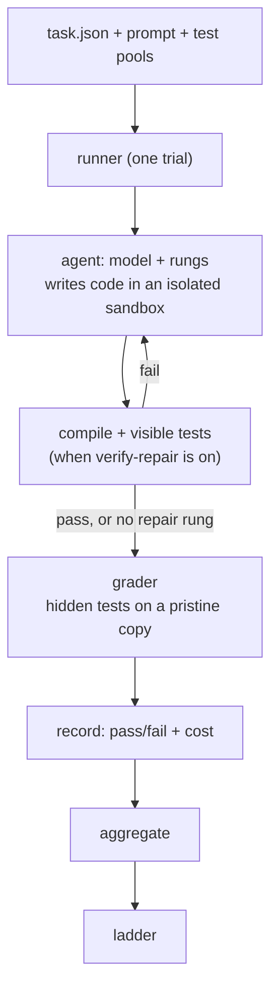

# Architecture

## Data flow

One trial is one (task, arm, seed).



The runner is the only component that executes a trial. It copies the task's
workdir into a sandbox outside the repository, builds a Pi agent there, applies the
arm's rungs, and runs under a turn budget (Pi has no hard step cap, so the runner
adds one). It then grades the agent's code on the hidden tests, in a separate
pristine copy inside the repository where the test toolchain resolves.

## Isolation and anti-cheat

The agent works in a temporary directory outside the repository. It cannot reach
the real task sources or the hidden tests. Grading copies the agent's final code
into a throwaway directory and runs the hidden tests there. No rung is given the
hidden command; rungs see only the visible tests. An agent cannot pass by editing
or weakening a test.

## Who writes the tests

The task author writes both visible and hidden tests, by hand or with a separate
strong model, offline. They are committed and frozen before any result is read. The
model under evaluation writes solution code only; it never writes tests. If it wrote
the tests it would be grading itself.

## Test pools and selection

Each task ships two disjoint pools of the same specification:
`tests/visible-pool/` and `tests/hidden-pool/`. Hidden tests are held-out cases,
not copies of the visible ones. Per task, the runner pops `nVisible` and `nHidden`
tests, chosen by `selectionSeed`. Selection is per task, not per trial: every arm
and seed of a task sees the same tests, so the comparison is clean. A task is
admitted only if a reference solution passes both pools while the stub fails the
visible pool.

## The Rung contract

A rung is one modification. It exposes up to four hooks, all optional.

```ts
interface Rung {
  name: string;
  apply?(build): void;                                // static knobs (prompt, tools, thinking)
  wrapStream?(inner): StreamFn;                       // transform the model stream
  wrapSample?(ctx, runAgent): Promise<void>;          // loop on one session
  wrapRun?(ctx, sampleOnce): Promise<SampleResult>;   // select across samples
}
```

- `apply`: `few-shot` (prompt append), `localization` (enable grep/find), `reasoning` (thinking level).
- `wrapStream`: `tool-call-adapter` rewrites a call the model wrote as JSON-in-text into a real tool call.
- `wrapSample`: `verify-repair` runs the visible tests after the agent stops and re-prompts with the failures, up to a cap.
- `wrapRun`: `best-of-N` takes N samples and keeps the one passing the visible tests.

Pi resolves `session.prompt()` when the agent stops calling tools, so rungs compose
at the prompt boundary, not per turn.

## Arms and the ladder

An arm is a model plus an ordered list of rungs:

```ts
const armB: Arm = {
  name: "B",
  label: "+ verify-repair + best-of-N",
  modelKey: "local-20b",
  rungs: [verifyRepairRung(), bestOfNRung(2)],
};
```

The ladder is a list of arms; the cumulative ladder adds one rung per step. An arm
may also set `modelId` and `baseUrl` to run a different local model. The floor and
the ceiling are two such arms.

## Provider wiring

`provider.ts` builds a Pi Model for a local model served over an OpenAI-compatible
endpoint. Any local model id works:

- Ollama-served models (`gpt-oss:20b`, `qwen2.5-coder`, ...) at `OLLAMA_BASE_URL`.
- A llama.cpp-served model at an explicit `baseUrl` (set per arm), for example a
  Mellum2 GGUF on `http://127.0.0.1:8080/v1`.

Endpoints are keyless; Pi still wants a non-empty key per provider, so the provider
is registered with a dummy one. Temperature is pinned equal across arms. There is no
seed parameter, so variance is handled by k seeds, not exact replay.

## Measurement

- Pass rate and cost per arm, not raw token counts.
- k seeds per arm for variance.
- Visible tests drive repair; hidden tests grade.
- The task set is fixed before results are read.
- Grading is deterministic. Every trial writes a transcript to `results/`, which is
  gitignored.

## Task manifest

```json
{
  "id": "swe-slugify-01",
  "family": "swe-util",
  "prompt": "prompt.md",
  "cwd": "workdir",
  "compileCmd": "npx tsc --noEmit slugify.ts",
  "visibleCmd": "npx vitest run tests/visible",
  "hiddenCmd": "npx vitest run tests/hidden",
  "nVisible": 5,
  "nHidden": 5,
  "selectionSeed": 1729,
  "timeoutSec": 120,
  "difficulty": "swe"
}
```

The loader checks every field, confirms the pools exist and are disjoint and large
enough, and rejects command strings that contain shell operators, so a task cannot
inject a command. It does not run the model.
