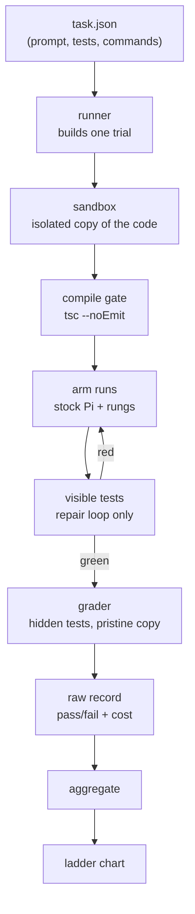

# Architecture

## Data flow

One trial is one `(task × arm × seed)`.



The runner is the only component that executes a trial. It clones the task workdir into a sandbox, builds a Pi agent, applies the arm's rungs, runs under a step and token budget, then hands the result to the grader. Stock Pi has no hard step cap; we add one in the runner.

## Who writes the tests

The task author writes both visible and hidden tests when authoring the task. A separate agent may pre-write them offline. They are committed to the task directory and frozen before any results are read.

The model under evaluation never writes tests. It writes solution code in `workdir/` only. If the model authored the tests it would grade itself, and no result would compare across arms or seeds. Tests are the measurement instrument, not part of the task the model solves.

The generating agent is a frontier model run offline, never the arm under test.

## Test pool and selection

Each task ships a test pool, larger than any single run uses, split into two disjoint sets of the same spec: `tests/visible-pool/` and `tests/hidden-pool/`. Hidden are held-out cases, not copies of visible.

Per run the task pops `nVisible` from the visible pool and `nHidden` from the hidden pool, chosen by `selectionSeed`. Selection is per *task*, not per trial. Every arm and every seed of a task pops the same tests, so the ladder stays a clean comparison. Rotate `selectionSeed` between campaigns; never within one.

Pool admission gate: before a pool test counts, it must pass against a known-good reference solution and fail against a known-bad mutation. This catches flaky or wrong agent-written tests before they poison the oracle.

## The Rung contract

A rung is one modification. It exposes up to three hooks, all optional.

```ts
interface Rung {
  name: string;
  apply?(build: BuildContext): void;                                  // static knobs
  wrapSample?(ctx, runAgent): Promise<void>;                          // loop on one session
  wrapRun?(ctx, sampleOnce): Promise<SampleResult>;                   // select across samples
}
```

- `apply` only: `reasoning` (thinking level), `few-shot` (prompt append), `localization` (enable grep/find).
- `wrapSample`: `verify-repair` runs visible tests after the agent stops, re-prompts the same session with failures, repeats to a cap.
- `wrapRun`: `best-of-N` takes N samples, selects the one passing visible tests.

Pi resolves `session.prompt()` when the agent stops calling tools, and binds its own `beforeToolCall`/`afterToolCall`. So rungs compose at the prompt boundary, not per turn.

## Arms and the ladder

An arm is stock Pi plus an ordered list of rungs.

```ts
const armB = arm("B", [verifyRepair, bestOfN]);
```

The ablation ladder is a list of arms. Cumulative ladder adds one rung per step. Leave-one-out drops one rung from the full set. Both are expressed as arm lists, no special code.

## Provider wiring

`provider.ts` builds a Pi Model for a local model served over an OpenAI-compatible
endpoint. Any local model id works:

- Ollama-served models (`gpt-oss:20b`, `qwen2.5-coder`, ...) at `OLLAMA_BASE_URL`.
- A llama.cpp-served model at an explicit `baseUrl` (set per arm), e.g. a Mellum2
  GGUF on `http://127.0.0.1:8080/v1`.

Endpoints are keyless; Pi still wants a non-empty key per provider, so we register
the provider with a dummy one. Temperature is pinned equal across arms. There is
no seed parameter, so variance is handled by k seeds, not exact replay.

## Grading and anti-cheat

The sandbox is a fresh isolated copy per trial. Hidden tests live outside anything the agent or any rung can reach. The grader runs hidden tests on a pristine copy. No rung references the hidden command. An agent cannot pass by weakening or editing a test.

## Measurement discipline

- Pass-rate and cost per arm. Not raw tokens (tokenisers differ).
- k seeds for variance.
- Visible tests drive repair. Hidden tests grade.
- Task set frozen before results are read.
- Deterministic grading. All transcripts published.

## Task manifest

```json
{
  "id": "failing-test-03",
  "family": "failing-test-fix",
  "prompt": "prompt.md",
  "cwd": "workdir",
  "compileCmd": "tsc --noEmit",
  "visibleCmd": "vitest run tests/visible",
  "hiddenCmd": "vitest run tests/hidden",
  "nVisible": 3,
  "nHidden": 5,
  "selectionSeed": 1729,
  "timeoutSec": 120,
  "difficulty": "band-2"
}
```

`nVisible`/`nHidden` pop from the pools; `selectionSeed` pins which tests, identically across all arms and seeds. The loader validates every field and rejects any task whose hidden command is referenced by a rung.
